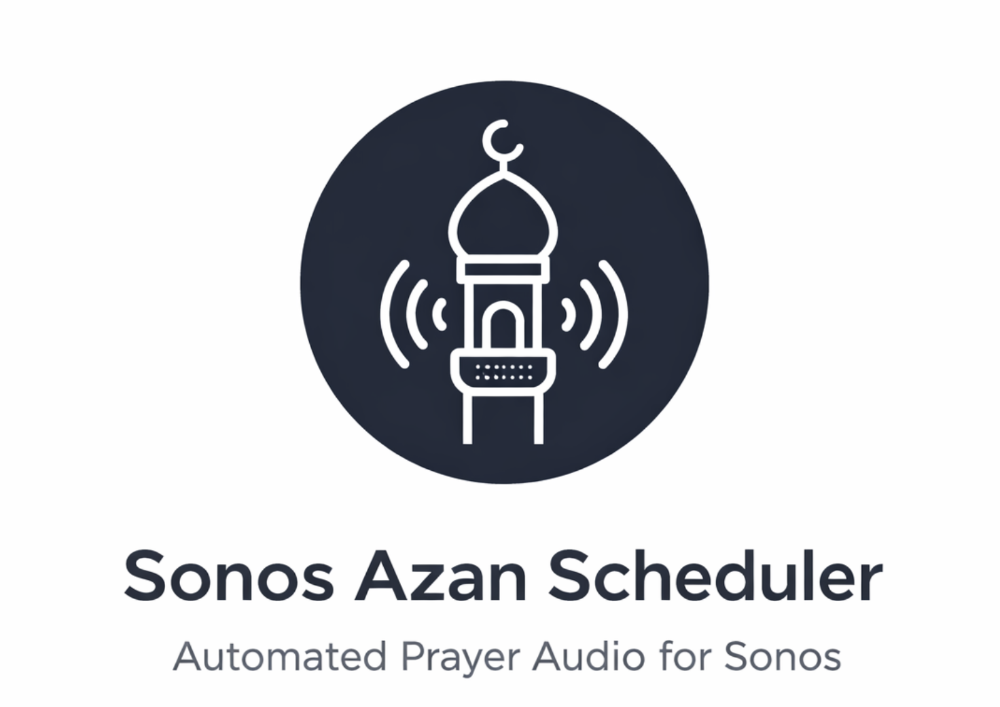
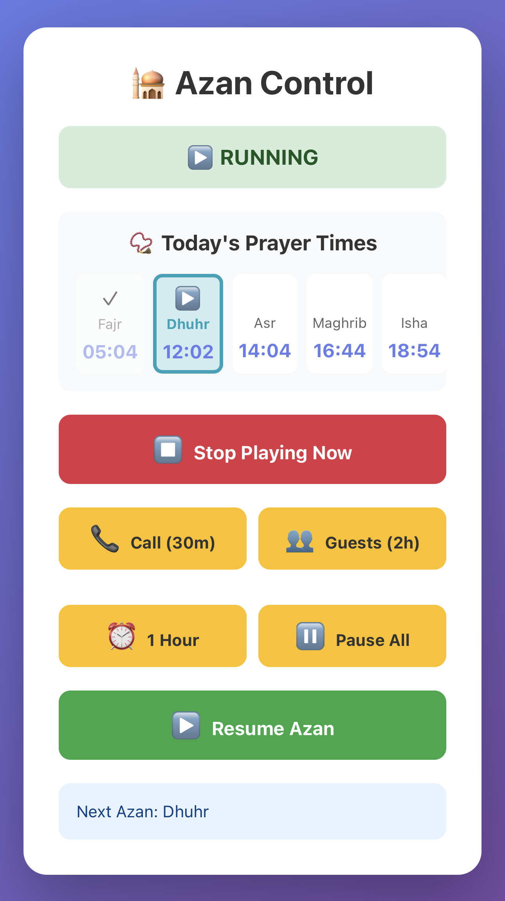

<div align="center">



# Sonos Azan Scheduler

[](https://opensource.org/licenses/MIT)
[](https://www.python.org/)
[](https://flask.palletsprojects.com/)

**Automated Islamic prayer call system for Sonos speakers**

*Brings the call to prayer to your home with scheduled playback and web control*

[Features](#features) • [Setup](#setup) • [Deployment](#production-deployment) • [Control](#controlling-the-scheduler)

</div>

---

## Features
- Fetches accurate prayer times from Aladhan API
- Plays Spotify track on Sonos at scheduled times
- Auto-refreshes daily
- Configurable for any location and Sonos speaker

## 📱 Web Interface

<div align="center">


*Mobile-friendly web interface for controlling your Azan scheduler*
</div>

**Control at your fingertips:**
- 🕌 View today's prayer times in real-time
- ⏹️ Stop playback instantly
- ⏸️ Quick pause presets (30m, 1h, 2h)
- ▶️ Resume scheduling anytime
- 📱 Works on any device (phone, tablet, desktop)

## Setup

### 1. Install Dependencies

```bash
pip3 install -r requirements.txt
```

### 2. Find Your Spotify Track URI

To get the Spotify URI for an Azan track:

1. Open Spotify (desktop or web)
2. Search for "Azan" or "Adhan"
3. Find a track you like (e.g., "Azan Mecca", "Sheikh Mishary Alafasy Adhan")
4. Right-click the track → Share → Copy Song Link
5. You'll get something like: `https://open.spotify.com/track/xxxxxxxxxxxxx`
6. Convert to URI format: `spotify:track:xxxxxxxxxxxxx`

**Popular Azan Tracks:**
- Search "Mishary Alafasy Adhan" on Spotify
- Search "Mecca Azan" on Spotify

### 3. Find Your Sonos Speaker IP (Optional)

Auto-discovery usually works, but if you want to specify:

```bash
# On Mac, find Sonos devices on your network
dns-sd -B _sonos._tcp .

# Or use Python to discover
python3 -c "import soco; print([(s.player_name, s.ip_address) for s in soco.discover()])"
```

### 4. Configure

Edit `config.json`:

```json
{
  "location": {
    "city": "New York",
    "country": "USA",
    "method": 2
  },
  "sonos": {
    "speaker_ip": "",
    "speaker_name": "Living Room",
    "volume": 30
  },
  "azan": {
    "prayers": {
      "Fajr": {
        "enabled": true,
        "spotify_uri": "spotify:track:YOUR_TRACK_ID"
      },
      "Dhuhr": {
        "enabled": true,
        "spotify_uri": "spotify:track:YOUR_TRACK_ID"
      },
      "Asr": {
        "enabled": true,
        "spotify_uri": "spotify:track:YOUR_TRACK_ID"
      },
      "Maghrib": {
        "enabled": true,
        "spotify_uri": "spotify:track:YOUR_TRACK_ID"
      },
      "Isha": {
        "enabled": true,
        "spotify_uri": "spotify:track:YOUR_TRACK_ID"
      }
    }
  }
}
```

**Configuration Options:**

- `location.city`: Your city name
- `location.country`: Your country name
- `location.method`: Calculation method (2=ISNA, 3=MWL, 4=Makkah, etc.)
- `sonos.speaker_ip`: Leave empty for auto-discovery, or specify IP
- `sonos.speaker_name`: Name of your Sonos speaker (if auto-discovering)
- `sonos.volume`: Volume level (0-100)
- `azan.prayers.<PrayerName>.enabled`: Enable/disable individual prayers (true/false)
- `azan.prayers.<PrayerName>.spotify_uri`: Spotify track URI for each prayer

**Features:**
- ✅ Different Azan track for each prayer (Fajr, Dhuhr, Asr, Maghrib, Isha)
- ✅ Enable/disable individual prayers
- ✅ Customize volume per speaker
- ✅ Automatic daily refresh of prayer times

### 5. Run

```bash
./start_azan.sh
```

## Production Deployment

For 24/7 operation on dedicated hardware, see our detailed deployment guides:

### Proxmox LXC Container (Recommended)
The most efficient option for home labs and Proxmox users. Lightweight, easy to manage, and perfect for always-on services.

📖 **[Complete LXC Deployment Guide](DEPLOYMENT.md)**

**Features:**
- Systemd service integration
- Auto-start on boot
- Minimal resource usage
- Easy management via Proxmox UI

### Raspberry Pi 5 with Docker
Ideal for a standalone dedicated device. Uses Portainer for easy container management.

📖 **[Raspberry Pi 5 Deployment Guide](PORTAINER_PI5_DEPLOYMENT.md)**

**Features:**
- Docker containerization
- Portainer web UI management
- Portable deployment
- Easy updates and rollbacks

Both guides include:
- ✅ Step-by-step installation
- ✅ Network configuration
- ✅ Service management
- ✅ Troubleshooting tips

## Controlling the Scheduler

### Quick Pause/Stop Commands

When you have guests, phone calls, or need to temporarily stop the Azan:

```bash
# Stop currently playing Azan immediately
./pause_azan.sh stop

# Pause for a phone call (30 minutes)
./pause_azan.sh call

# Pause for guests (2 hours)
./pause_azan.sh guests

# Pause for 1 hour
./pause_azan.sh 1h

# Pause indefinitely
./pause_azan.sh

# Resume when ready
./resume_azan.sh
```

### Advanced Control

```bash
# Pause for custom duration (e.g., 45 minutes)
python control_azan.py pause -m 45

# Check current status
python control_azan.py status

# Resume
python control_azan.py resume

# Stop current playback
python control_azan.py stop
```

## Run at Startup (macOS)

To run automatically when your Mac starts:

### Option 1: Create Launch Agent (Recommended)

Create file at `~/Library/LaunchAgents/com.azan.scheduler.plist`:

```xml
<?xml version="1.0" encoding="UTF-8"?>
<!DOCTYPE plist PUBLIC "-//Apple//DTD PLIST 1.0//EN" "http://www.apple.com/DTDs/PropertyList-1.0.dtd">
<plist version="1.0">
<dict>
    <key>Label</key>
    <string>com.azan.scheduler</string>
    <key>ProgramArguments</key>
    <array>
        <string>/usr/local/bin/python3</string>
        <string>/Users/YOUR_USERNAME/azan-scheduler/azan_scheduler.py</string>
    </array>
    <key>WorkingDirectory</key>
    <string>/Users/YOUR_USERNAME/azan-scheduler</string>
    <key>RunAtLoad</key>
    <true/>
    <key>KeepAlive</key>
    <true/>
    <key>StandardOutPath</key>
    <string>/Users/YOUR_USERNAME/azan-scheduler/azan.log</string>
    <key>StandardErrorPath</key>
    <string>/Users/YOUR_USERNAME/azan-scheduler/azan.error.log</string>
</dict>
</plist>
```

Then load it:
```bash
launchctl load ~/Library/LaunchAgents/com.azan.scheduler.plist
launchctl start com.azan.scheduler
```

### Option 2: Run in Terminal

Just keep the terminal window open:
```bash
python3 azan_scheduler.py
```

## Testing

Test the Azan immediately:

```bash
python3 -c "
import json
from azan_scheduler import AzanScheduler
scheduler = AzanScheduler()
scheduler.discover_sonos()
scheduler.play_azan('Test')
"
```

## Troubleshooting

### Sonos not found
- Make sure your Mac and Sonos are on the same network
- Check if Sonos app works on your Mac
- Try specifying the speaker IP in config.json

### Spotify track not playing
- Make sure you have Spotify Premium
- Verify the Spotify URI is correct
- Check that your Sonos is linked to your Spotify account

### Prayer times wrong
- Verify your city/country spelling
- Try different calculation methods (1-12)
- Check https://aladhan.com/calculation-methods for method details

## Logs

Logs are saved to:
- `azan.log` - Standard output
- `azan.error.log` - Error messages

View logs:
```bash
tail -f azan.log
```

## Credits

This project is built with the help of these amazing open-source projects:

- **[Aladhan API](https://aladhan.com/)** - Provides accurate Islamic prayer times for locations worldwide
- **[SoCo](https://github.com/SoCo/SoCo)** - Python library for controlling Sonos speakers
- **[Flask](https://flask.palletsprojects.com/)** - Web framework for the control interface
- **[APScheduler](https://apscheduler.readthedocs.io/)** - Advanced Python task scheduler

Special thanks to the maintainers and contributors of these projects for making this automation possible.
